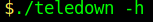

# Teledown

Teledown is a `python` script that automate downloading pictures from multiple telegram channels at once.
## Prerequisites
Before your can use Teledown, please ensure that your have installed the following packages.
* Requests module
* BeautifulSoup module

## Installing

```
git clone https://github.com/Codereverse12/Teledown.git
cd Teledown
pip3 install -r requirement.txt
chmod +x teledown
```

## Using Teledown
**SYNOPSIS:**

&nbsp;&nbsp;&nbsp;&nbsp;&nbsp;&nbsp;`./teledown [OPTION] CHANNELNAME...`<br/>

### Disclaimer:

The `CHANNELNAME` is the name after the protocol and the hostname.

&nbsp;&nbsp;e.g,  `https://t.me/[CHANNELNAME]`

**Basic command:**<br/>

&nbsp;&nbsp;&nbsp;&nbsp;&nbsp;&nbsp;<br/><br/>
**Help command:**<br/>

&nbsp;&nbsp;&nbsp;&nbsp;&nbsp;&nbsp;


